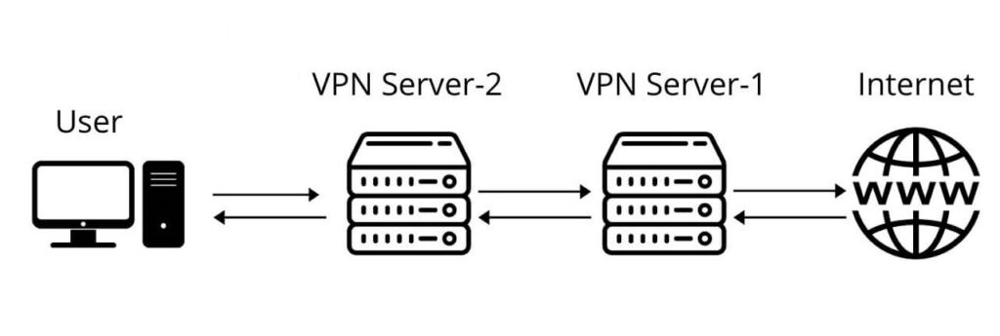

# VPNChain OpenVPN, Stunnel and OpenConnect



### VPN Chain
The earliest mention I can find of VPN chains is a [2010 article](https://secure-computing.net/wiki/index.php/OpenVPN/VpnChains) by Eric Crist. That article envisaged a literal chain, in which one client connects to a server, which in turn connects to a further server, and on. It did not give any practical details.

The interest in VPN chains since then has been more in tunneling one connection through another. In particular, the question of how to build a tunnel through a tunnel was raised in a [2011 forum thread](https://forums.openvpn.net/viewtopic.php?t=7483) started by Bebop. A finished set of bash scripts was posted on [SourceForge](https://sourceforge.net/p/vpnchains/wiki/Home/) in 2012 by br41n. In 2017, the scripts were added to [GitHub](https://github.com/bitnom/VPN-Chain) by TensorTom. These inspired Mirimir to create an alternative set of [bash scripts](https://github.com/mirimir/vpnchains) in 2019.

A VPN chain disguises your destination from your ISP and VPN1, and disguises your origin from VPN2 and your final destination website. If your goal is anonymity, you will likely use commercial VPN services who accept anonymous payment. However, for demonstration purposes we will build our own VPN servers from scratch.

### OpenVPN + Stunnel + Openconnect
People in not-free countries often have a problem with OpenVPN connections being blocked by government censors. This article describes one possible solution. OpenVPN is tunneled through Stunnel, thus resembling a TLS connection on port 443. Whether or not this gets through Deep Packet Inspection (DPI) depends on the sophistication of the DPI. It may work in some countries but not in others. We include server name indicator (SNI) in the TLS to make the connection look a bit more like a real HTTPS connection.

The two servers and one client in this demonstration two servers run [ubuntu 20.04 LTS](https://releases.ubuntu.com/focal/) and client run windows. We will give the IP addresses of the two servers as 11.11.11.11 and 22.22.22.22 respectively. We also refer to them as Server-1 and Server-2.

### Let's Start
#### 1. Set Up Server 1 (OpenVPN + Stunnel)
download and run script for Server-1
```bash script
git clone https://github.com/ysoheilifar/VPNChain-OVPN-Stunnel-OpenConnect.git
cd VPNChain-OVPN-Stunnel-OpenConnect
chmod +x Server-1.sh
bash Server-1.sh
```
Check also that OpenVPN is listening for TCP input on port 1194 and Stunnel is listening for TCP input on port 8080
```bash script
ss -tulpn | grep -e 1194 -e 8080
```
copy location of `irfree.ovpn` file created by openvpn on Server-1 in this demonstration on `/root/VPNChain-OVPN-Stunnel-OpenConnect/irfree.ovpn`
